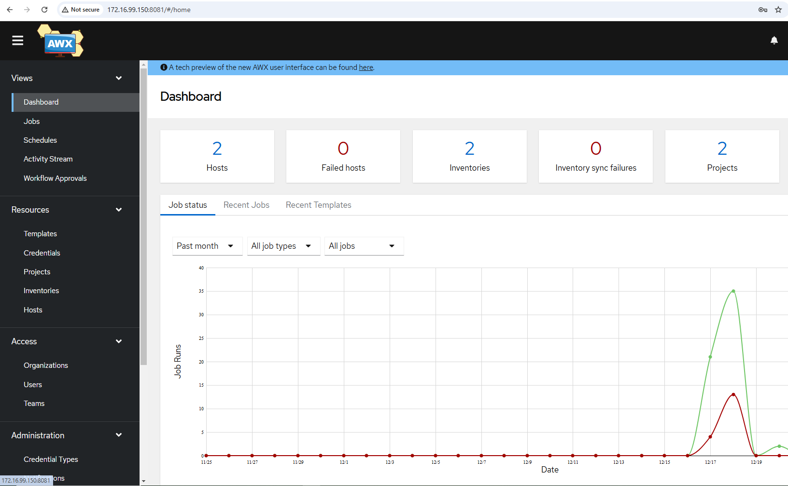
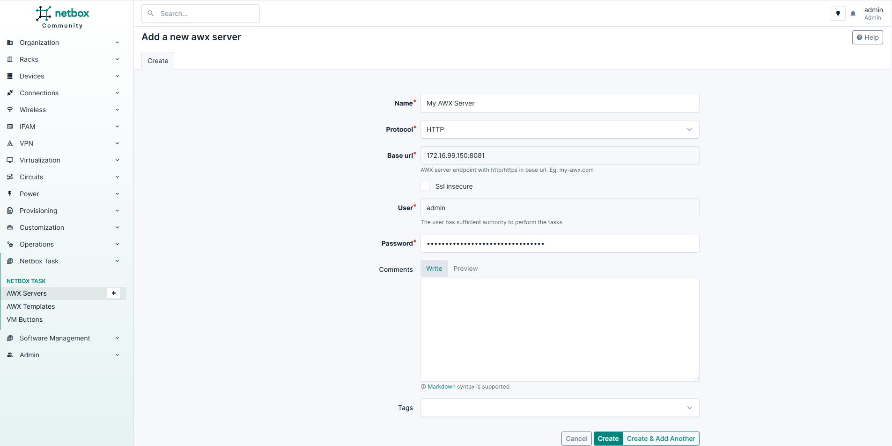
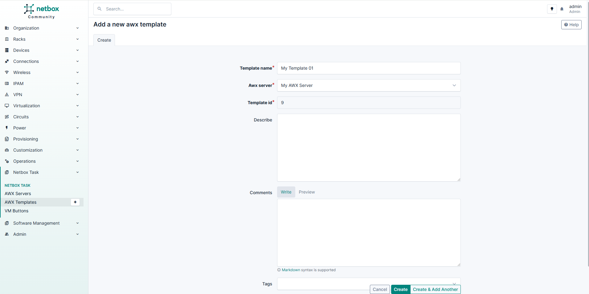

## A. Create AWX Server

Let's assume we have an AWX server running at `http://172.16.99.150:8081`

In Netbox, follow by these steps to add AWX server into the netbox

**Left Sidebar --> Netbox Task --> AWX Servers**

- Name: Any name
- Protocol: http/https
- Base URL: FQDN or ip:port address
- SSL Insecure: Yes/No
- User: The user will be used to excute AWX Template Task
- Password: Password of above user

Because we may have a lot of AWX servers, if there are any more servers so it will be continue declared here.

## B. Create AWX Templates

Template is a concept of AWX. Each template corresponds to a playbook. At netbox, the template must belong to an awx server.

**Left Sidebar --> Netbox Task --> AWX Templates**

- Name: Any
- AWX Server: It is an awx server which template belong to
- Template ID: The ID can be obtained from awx server

