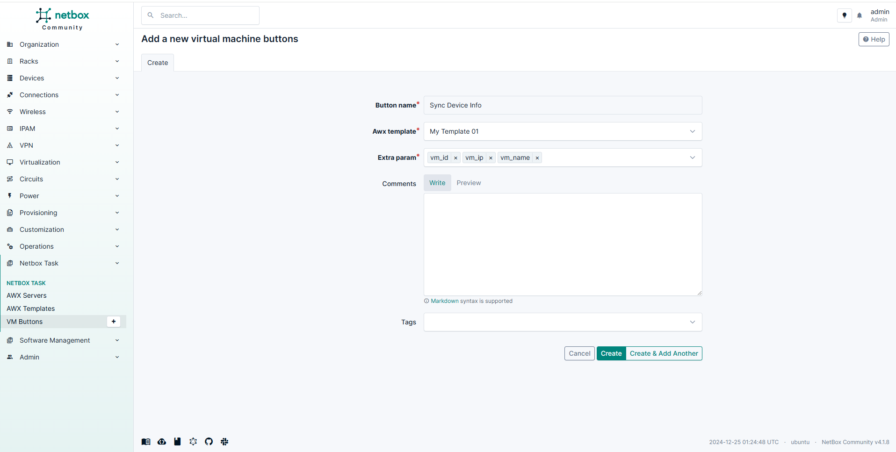
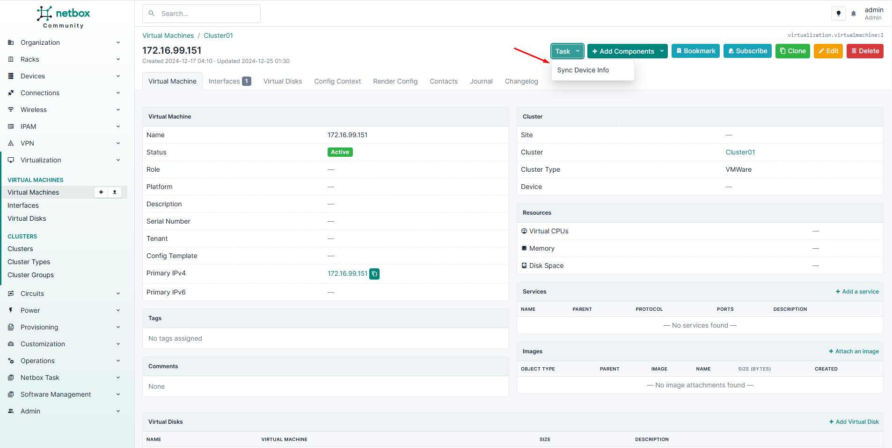
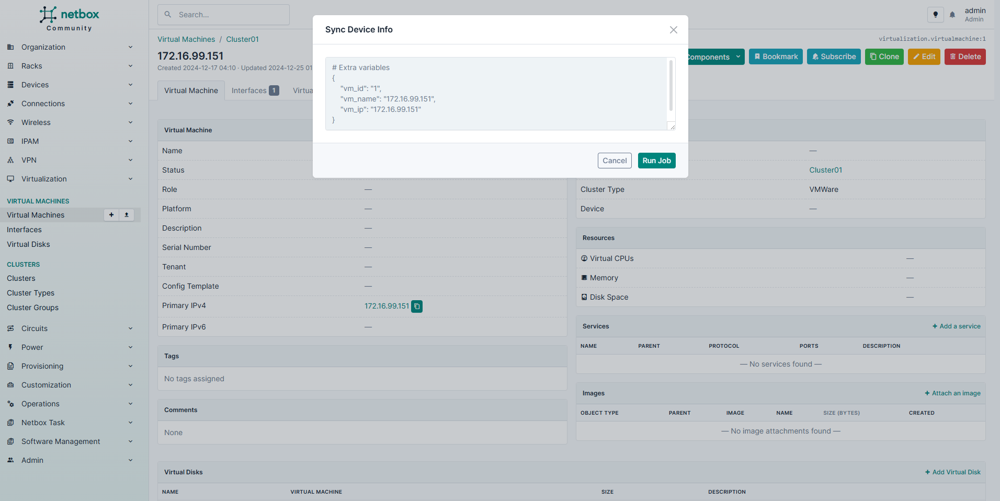
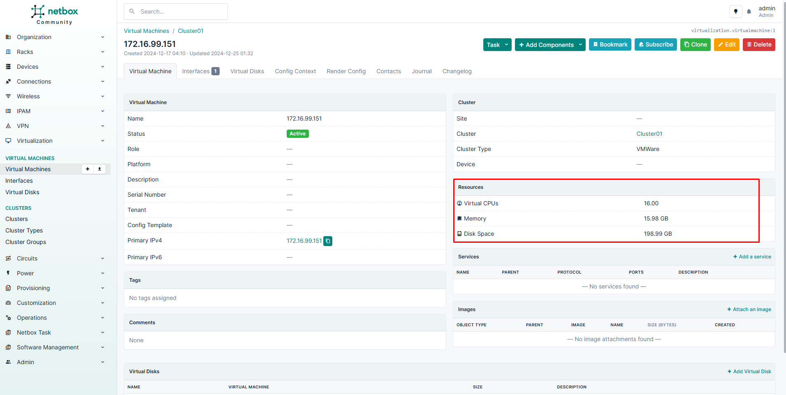

## A. Declare Buttons

After declaring the template, we will define the corresponding buttons and actions

**Left Sidebar --> Netbox Task --> VM Buttons**

If you have multiple playbooks (templates), you can declare them corresponding to multiple buttons here.

## B. Run task

Because our Template named  `My Template 01` is a playbook which will excute some API to collect some Virtual Machine Infomations and update back to netbox.

*In this demo, we will obtain CPU core, Memory, Disk Space only*

**Left Sidebar --> Virtual Machines --> Virtual Machines**

Select any Virtual Machine here. You will see the button `Tasks` at the top right of page

Then wait for the task is completed

